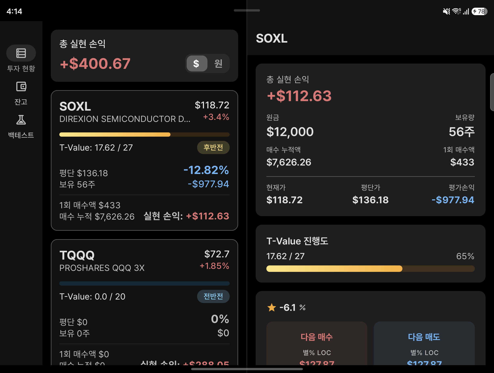

# Snowball

Android/iOS 투자 관리 앱 — Kotlin Multiplatform 기반

## Architecture

## Screenshots

### 일반

  

### 폴더블

펼친 화면에서는 왼쪽에 목록, 오른쪽에 상세를 나란히 보여줍니다. 접은 화면은 일반과 동일합니다.

## Module Structure

| 모듈 | 역할 |
|------|------|
| `:app` | 앱 진입점 · DI 설정 |
| `:navigation` | 화면 전환 · Back Stack 관리 (Decompose) |
| `:feature:home` | 포트폴리오 · 투자 현황 |
| `:feature:account` | 계좌 관리 |
| `:feature:backtest` | 백테스트 엔진 · 결과 차트 |
| `:feature:detail` | 종목 상세 · 가격 히스토리 |
| `:core:ui` | 공통 UI 컴포넌트 · 테마 |
| `:core:domain` | 비즈니스 로직 · UseCase |
| `:core:data` | 데이터 접근 · Repository · Ktor |
| `:snowball-models` | 공유 데이터 모델 |

## Tech Stack

- **UI** — Compose Multiplatform · Material3
- **Navigation** — Decompose · Essenty
- **DI** — Koin
- **Network** — Ktor Client
- **Async** — Kotlin Coroutines · Flow
- **Serialization** — kotlinx-serialization
- **Image** — Coil3
